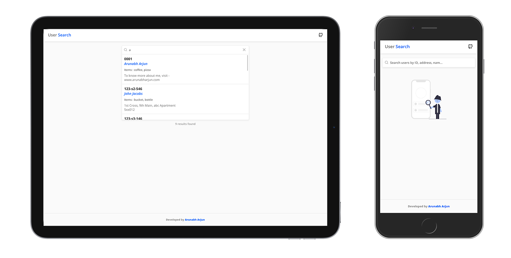

# Client Side Search

[](https://arunabharjun.com)

## ▶️ Getting Started

1. Open terminal in your project directory

2. Clone the repo

```bash
git clone https://github.com/arunabharjun/react-client-side-search.git
```

## ⬇️ Installing dependencies

1. Open terminal in the root directory and run the following command

```bash
npm instal
```

2. Start the react app

```bash
npm start 
```

## 🖥 Viewing the app

The app should have opened in your default browser, but if didn't, visit [http://localhost:3000/](http://localhost:3000/)

## 🌟 Features

1. Search users by ID, address, name, items, pincode
2. Navigate using keyboard up and down arrow keys
3. Hover on a card to change focus to that card like
4. The mouse and keyboard actions mimic youtube's search box actions
5. The search happens on client side much like how a phone would search contact list in phonebook app
6. Responsive design